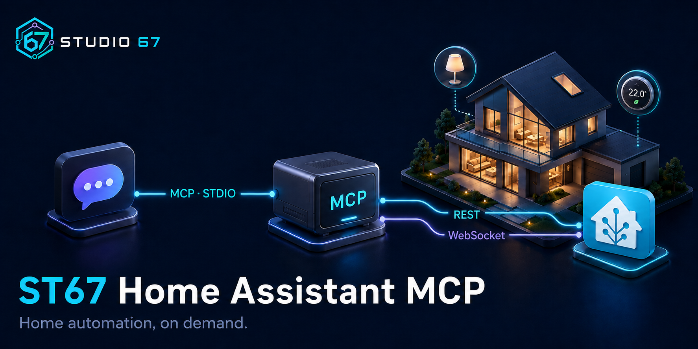

**English** · [Русский](README.ru.md)



# ST67 Home Assistant MCP

**Control Home Assistant from an MCP client: read device states, call services, and run configuration commands through REST and WebSocket.**

A lightweight, open-source **Home Assistant MCP server** by Studio 67. It runs locally over the Model Context Protocol (MCP), connects to your own Home Assistant on demand, and keeps each installation's configuration separate from the code.

**0.1.0** · Node.js 24 · TypeScript · [MIT license](LICENSE)

[Install](#installation) · [Connect your client](#connect-an-mcp-client) · [Tools](#tools) · [Security and scope](#security-and-scope) · [Русская инструкция](README.ru.md)

## What you can do

| Your task | How the bridge helps |
|---|---|
| Check a temperature or device state | Read Home Assistant states over REST |
| Turn on a light or activate a scene | Call Home Assistant services |
| Work with the entity registry | Send supported WebSocket commands |
| Wait for an event during a task | Collect a bounded number of events within one call |
| Connect more than one home | Run independent processes with separate settings and credentials |

Three general-purpose tools cover the API instead of adding a separate tool for every device. REST and WebSocket complement each other; available operations depend on your Home Assistant version, integrations, and token permissions.

There is no background monitoring, persistent subscription, database, web dashboard, or separate daemon. The MCP client starts the local process. API connections open when a tool is called.

**Verified:** macOS, registration in Codex, the installed STDIO process through an MCP SDK client, HTTPS and secure WebSocket with Home Assistant 2026.9.1, and a real light switched on and off with state read-back. Other MCP clients and Windows/Linux have not been independently tested.

## Installation

You need **Node.js 24**, npm, access to your Home Assistant, and a token with the permissions required for your tasks. macOS Keychain is supported on macOS. The environment source does not depend on Keychain, but Windows/Linux remain unverified.

Download the repository source, open its directory in Terminal, and run:

```sh
npm ci --ignore-scripts --no-audit --no-fund
npm run typecheck
npm test
npm run pack:dry
```

`npm test` builds fresh code before running tests. Test data is synthetic; tests need temporary loopback HTTP/WS ports. The TLS test requires OpenSSL and removes its temporary certificate and key. Tests do not read your real Keychain.

For a separate runtime installation, build a package:

```sh
npm run build
npm pack --ignore-scripts
```

Extract `st67-home-assistant-mcp-0.1.0.tgz` into a separate version directory. Open its `package` directory and install runtime dependencies:

```sh
npm ci --omit=dev --ignore-scripts --no-audit --no-fund
```

The included `npm-shrinkwrap.json` pins dependencies for both source and packaged installations. Configure your client to run `node` with that installation's `dist/index.js` as its argument. Use an installed copy for everyday operation rather than a changing development checkout.

Running `node dist/index.js` directly starts a STDIO server waiting for an MCP client; it is not an interactive command prompt. Without configuration it provides local status and returns a clear error for API calls without contacting Home Assistant.

## Connect an MCP client

Your client must support **local STDIO servers**. The following fields were checked against the Codex form; names may differ in other clients. A saved server may require reconnection before its tools appear in the current conversation.

1. Open your client's MCP settings and add a custom server.
2. Select **STDIO**.
3. Choose a name, for example `home-assistant-example`.
4. Set the command to the absolute path to Node.js. On macOS, `command -v node` shows it; use your platform's equivalent on Windows.
5. Add the absolute path to the installed `dist/index.js` as one argument. A path containing spaces must remain one argument, following the client's input format.
6. Add the nonsecret environment settings below. Do not paste the token into ordinary MCP configuration.
7. Save and reconnect. Check for `ha_status`, `ha_rest`, and `ha_ws`; call `ha_status` first.
8. With authorization to access your instance, call `ha_rest` with `method: "GET", path: ""`. This verifies actual authentication; `ha_status` alone does not validate a token.

A form accepting only a server URL cannot connect to this STDIO implementation. Your Home Assistant URL is not an MCP server URL.

For another Home Assistant instance, create a separate entry with its own URL and credential reference. The Node executable and installed code can be shared; processes and credentials remain independent.

## Configuration and credentials

| Variable | Purpose |
|---|---|
| `HA_BASE_URL` | Root URL such as `https://ha.example.invalid`; path prefixes, query strings, and embedded credentials are rejected |
| `HA_TOKEN_SOURCE` | `keychain` or `environment` |
| `HA_KEYCHAIN_SERVICE` | Service name of your Keychain item |
| `HA_KEYCHAIN_ACCOUNT` | Account name of your Keychain item |
| `HA_TOKEN_ENV_NAME` | Name of an already inherited environment variable containing the token, not the token itself |
| `HA_ALLOW_HTTP` | Only the exact value `true` allows unencrypted HTTP/WS; disabled by default |

Synthetic macOS example containing no credentials:

```text
HA_BASE_URL=https://ha.example.invalid
HA_TOKEN_SOURCE=keychain
HA_KEYCHAIN_SERVICE=home-assistant-example
HA_KEYCHAIN_ACCOUNT=mcp-example
```

Create a password item in macOS Keychain using your chosen service/account and enter the token yourself in the application's protected field. The bridge reads that specific item using `/usr/bin/security` without shell interpolation. It does not create or modify credentials. macOS may require the owner's approval.

### Repeated Keychain prompts

`ha_status` never reads a token. API calls allow up to 10 seconds to retrieve it. Configure access for the system utility before using the bridge; a one-time **Allow** is not persistent authorization. If **Always Allow** does not resolve repeated prompts, check the specific item's partition list as well as its trusted applications. Do not broaden permissions for the entire keychain or unrelated items.

Use Keychain Access's protected field for long tokens. On the tested macOS, the interactive `security add-generic-password -w` input truncated values at 128 characters, making that entry method unsuitable for long Home Assistant tokens. Do not work around it by putting the token in command-line arguments.

`SECRET_UNAVAILABLE` means credential retrieval failed before the API request. If Home Assistant rejects authentication, stop retries and check the token: repeated failed authentication can trigger an IP ban.

### Environment source

Supply the secret through a protected launch environment beforehand. Setting `HA_TOKEN_ENV_NAME` does not create that variable. A graphical client may not inherit your Terminal environment; verify its behavior during setup.

Do not store a token in `.env`, JSON, TOML, examples, launch arguments, shell history, or ordinary MCP configuration. The runtime obtains it during an API call; the assistant does not need its value. JavaScript cannot guarantee physical erasure of every in-memory string copy.

## Tools

### `ha_status`

Reports the bridge version, whether configuration is valid, the credential source type, and the absence of monitoring. It does not contact Home Assistant or read credentials. Invalid configuration produces a safe error code without exposing values.

### `ha_rest`

Calls a supported method under Home Assistant's `/api/`:

- `method`: `GET`, `HEAD`, `OPTIONS`, `POST`, `PUT`, `PATCH`, or `DELETE`. Home Assistant determines which method/path combinations are supported.
- `path`: relative API path, such as `states` or `services/light/turn_on`. Use `""` for `/api/`. Leading slashes, `..`, fragments, embedded queries, and other hosts are rejected.
- `query`: optional array of string pairs; repeated keys are allowed.
- `body`: optional JSON value. For text, specify `contentType: "text/plain"` or `"application/yaml"`; JSON is the default. `GET` and `HEAD` cannot contain a body.
- `allowBinary`: defaults to `false`; enable only when the user explicitly permits returning the particular binary content.

Read a state:

```json
{"method":"GET","path":"states/sensor.example"}
```

Turn on an explicitly authorized light:

```json
{"method":"POST","path":"services/light/turn_on","body":{"entity_id":"light.example"}}
```

These entity names are placeholders. Select a real target before issuing a write.

Returns HTTP status, content type, encoding, and data. JSON, text, and small binary responses are supported. Opted-in binary data is returned as base64 with `binaryUninspected: true`: **its contents are not guaranteed to be free of secrets**. Literal-token byte checks cannot detect every encoding, compressed secret, or other private value in a container.

### `ha_ws`

Sends a supported Home Assistant `command`. The bridge owns authentication and request IDs; user-supplied IDs and authentication messages are rejected.

```json
{"command":{"type":"config/entity_registry/list"}}
```

Each call opens a connection, authenticates, sends one command, receives its result, and closes the socket. Home Assistant errors, result messages, and pong responses are handled explicitly. Some administrative commands require administrator permissions.

To collect events for a particular task, provide a subscription command, `eventLimit` from 1 to 100, and optionally `waitMs` from 1 to 30000. The default `eventLimit: 0` disables event waiting. When enabled, its default duration is five seconds within the overall call deadline.

```json
{"command":{"type":"subscribe_events","event_type":"state_changed"},"eventLimit":1,"waitMs":5000}
```

The response includes the command result, events, and completion reason. No events before the deadline is a normal empty result. Interrupted or size-limited event collection is marked incomplete. The connection and subscription end with the call; nothing is retained for a later call.

## Limits and failures

- Maximum request: 1 MiB. Raw response: 2 MiB. Final MCP representation, including duplicated content and JSON escaping: 2 MiB. Oversized output becomes an explicit error.
- Overall call deadline, including credential retrieval: 30 seconds. WebSocket authentication and Keychain retrieval each allow up to 10 seconds within that deadline.
- Up to four concurrent API calls per process; a fifth receives `BUSY` without an unbounded queue.
- TLS verification is enabled; redirects are rejected. The bridge does not change DNS or network settings.
- HTTP errors preserve their status. JSON and text are redacted for the known token, Bearer/JWT patterns, and credential fields. This is not universal data-loss prevention or a guarantee against encoded secrets.
- Raw exceptions, Keychain stderr, authorization headers, and complete responses are not logged. stdout is reserved for MCP.
- A timeout, cancellation, or disconnect after sending may leave the remote outcome unknown (`resultUnknown`). Commands are never retried automatically. Read the actual state before retrying a write.

Client shutdown or cancellation closes active connections. A new process does not restore or replay previous commands.

## Security and scope

The bridge acts with your token's Home Assistant permissions. It does not bypass roles, sandbox the remote service, or independently provide SSH, operating-system access, arbitrary file access, or Supervisor access. Calling Home Assistant services can change devices and settings; authorization remains the responsibility of the client and user.

REST can control a light; WebSocket can manage entity-registry settings. Creating an entity depends on its integration: there is no universal operation to create any entity. Check version-specific and third-party capabilities separately.

Streaming video, SSE, multipart uploads, binary WebSocket frames, and shared WebSocket sessions across calls are not supported. Supporting both API transports does not imply complete parity with the Home Assistant interface.

Returned data reaches the MCP client and may enter model context and conversation history. The absence of bridge logging does not remove client history. There are no automatic event subscriptions, messages to conversations, or model wakeups.

## Updates, rollback, and removal

Install a new version in a separate directory, verify it, then switch the client's launch path. Rollback means selecting a previously verified installed version. There is no earlier public release available at this initial stage.

To uninstall, disable and remove the relevant MCP entry, ensure its process has stopped, and remove only the installed copy if no other entry uses it. Deleting the Keychain item and revoking the token are separate user actions. Other installations, source code, and credentials are not removed automatically.

## Development and verification

- `src/config.ts`, `src/secrets.ts`: nonsecret settings and lazy token retrieval.
- `src/rest.ts`, `src/websocket.ts`: protocol handling and response limits.
- `src/bridge.ts`, `src/operation.ts`: deadlines, cancellation, concurrency, and cleanup.
- `src/redaction.ts`, `src/errors.ts`: redaction and safe failures.
- `src/server.ts`, `src/index.ts`: three MCP tools and the STDIO entrypoint.
- `tests/`: synthetic protocol servers and tests; no real Home Assistant or Keychain required.

The implementation passed 70 tests covering REST/WS, authentication failures, malformed messages, paths, redirects, TLS, binary opt-in, raw and serialized limits, concurrency, repeated cancellation, isolated instances, 200 sequential WebSocket calls, 1,000 events capped at 100, process shutdown/restart without replay, and MCP SDK calls over STDIO. Clean package installation and independent review were also completed.

Live testing of the installed bridge verified authenticated reading, WebSocket configuration reading, and an authorized light switched on and off with state read-back. Private connection settings and device data are excluded from this repository.

## License

[MIT](LICENSE), Copyright © 2026 Studio 67. `private: true` in package.json prevents accidental npm publication; it does not restrict source distribution under MIT. This is an independent Studio 67 project, not an official Home Assistant or OpenAI product.

## References

- [Home Assistant REST API](https://developers.home-assistant.io/docs/api/rest/)
- [Home Assistant WebSocket API](https://developers.home-assistant.io/docs/api/websocket/)
- [Entity registry implementation](https://github.com/home-assistant/core/blob/dev/homeassistant/components/config/entity_registry.py)
- [Automation implementation](https://github.com/home-assistant/core/blob/dev/homeassistant/components/config/automation.py)
- [MCP client configuration](https://learn.chatgpt.com/docs/extend/mcp?surface=cli)
